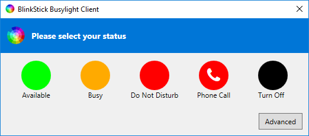
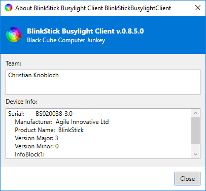

# BlinkStick Busylight Client

A Busylight Client for the [BlinkStick Pro](https://www.blinkstick.com/).

## Install or Build by yourself
### Included Projects
Included projects:
- BlinkStickBusylightClient

### Installation File
The [latest Version](https://github.com/DerKnob/BlinkStickBusylightClient/releases/latest) can be downloaded as installer.

### Checkout & Build
Checkout the project with git. Then open then Visual Studio solution. Go to **Extras->NuGet Package Manager->Package Manager Console** to open the **Package Manager Console**. Then type the command *Update-Package* to update the dependencies. If you want to setup it manually, have a look at the **3rd Party Libs** list. Now the build should work.

## Screenshots
The UI is not a gamechanger - but it's working ;-)

## 3rd Party License
- BlinkStickDotNet.dll
- [FontAwesome](https://fontawesome.com/)

## ToDo
The following tasks are open:
- [x] Keyboard Shortcuts
- [x] Connect / Disconnect monitor
- [x] Change color on dekstop locking / unlocking
- [x] Save / Restore settings
- [x] Pulse and Blink is not working correct
- [x] Disconnect somtimes not correctly handled

## Known Issues
- Only working with BlinkStick Pro
- Not working with multiple BlinkSticks connected

## Ideas for the Future
- [ ] Connect to "Skype for Business" and sync the available state
